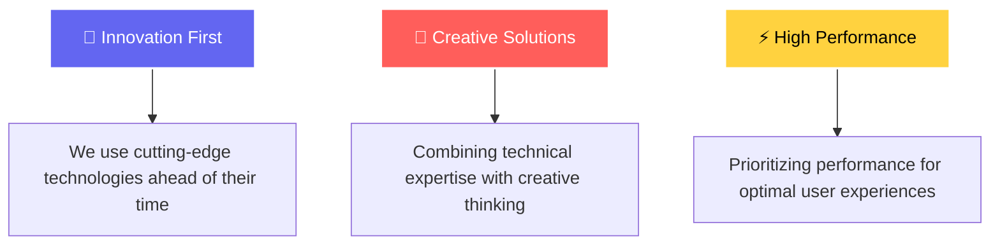
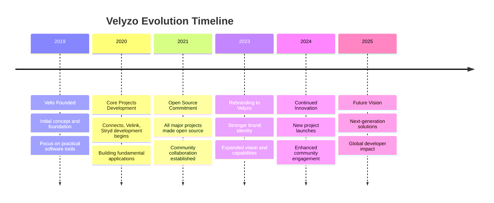

# 🚀 Velyzo - Revolutionary Software Development

<div align="center">

[](https://velyzo.github.io)
[](https://github.com/velyzo)
[](https://ko-fi.com/velyzo)
[](https://discord.gg/mrgg7vuF48)

**Creating the future through cutting-edge technologies**

*From iOS apps to complex web solutions - transforming visions into digital reality*

[🎯 **Explore Projects**](#-our-projects) • [👥 **Meet the Team**](#-team) • [💖 **Support Us**](#-support-our-work) • [📧 **Contact**](mailto:mail@velyzo.de)

---


</div>

## ✨ About Velyzo

**Velyzo** is a cutting-edge software development organization founded by **Devin Oldenburg**, dedicated to creating innovative, practical solutions that meet real-world user needs. We combine state-of-the-art technologies with thoughtful design to build products that are not only functional but exceptional.

### 🎯 Our Mission

> *"We create innovative software solutions that improve people's lives and help companies achieve their goals through cutting-edge technologies and thoughtful development processes."*

### 🌟 Core Values



---

## 🛠 Our Projects

<div align="center">

### 🌟 Featured Applications

</div>

<table>
<tr>
<td width="50%">

### 📱 [Connecto](https://github.com/velyzo/connecto)
**HTTP Request Tool for iOS & Apple Watch**

- 🔧 Send and manage HTTP requests directly from iOS devices
- ⌚ Apple Watch compatibility with seamless synchronization
- 🎯 Perfect for developers and API testing on the go

[](https://testflight.apple.com/join/connecto)
[](https://github.com/velyzo/connecto)

</td>
<td width="50%">

### 🖥️ [WidgetDock](https://github.com/widgetdock)
**Comprehensive Widget Manager for macOS**

- 🎛️ Organize, customize and manage all desktop widgets
- 🔥 One centralized place for all your macOS widgets
- ⚡ Boost productivity with smart widget management

[](https://github.com/widgetdock)
[](https://github.com/widgetdock)

</td>
</tr>
<tr>
<td width="50%">

### 🔗 [Velink](https://velink.me)
**Modern Link Shortener with Analytics**

- ✨ Create beautiful, personalized short links
- 📊 Advanced analytics and performance tracking
- 🎨 Fully customizable link pages

[](https://velink.me)
[](https://github.com/velyzo/velink)

</td>
<td width="50%">

### 🏃‍♂️ [Stryd](https://github.com/velyzo/stryd)
**Advanced Fitness Tracking & Comparison**

- 👟 Advanced step counter and activity tracking
- 👥 Compare performance with friends
- 📈 Detailed fitness analytics and insights

[](https://github.com/velyzo/stryd)
[](https://github.com/velyzo/stryd)

</td>
</tr>
<tr>
<td width="50%">

### 🍓 [PiVision](https://github.com/velyzo/pivision)
**Raspberry Pi Monitoring for iPhone**

- 🖥️ Comprehensive Pi performance monitoring
- 📱 Beautiful iPhone interface
- 🔧 Remote service management capabilities

[](https://github.com/velyzo/pivision)
[](https://github.com/velyzo/pivision)

</td>
<td width="50%">

### 🔐 [PassKit Reader](https://github.com/velyzo/passkit-reader)
**iOS Device Information Tool for macOS**

- 📱 Read all available iOS device data
- 💻 Powerful macOS tool for device analysis
- 🔍 Comprehensive system information display

[](https://github.com/velyzo/passkit-reader)
[](https://github.com/velyzo/passkit-reader)

</td>
</tr>
</table>

<div align="center">

### 🎁 Plus 14 More Open Source Projects!

*Explore our complete portfolio including Eulionline, Dividend Dreams, Anime Watcher, and many more innovative tools and applications.*

[](https://velyzo.github.io/#projects)

</div>

---

## 🛠 Technology Stack

<div align="center">

### 🚀 Languages & Frameworks

[](https://swift.org/)
[](https://www.typescriptlang.org/)
[](https://reactjs.org/)
[](https://nodejs.org/)
[](https://python.org/)

### 📱 Mobile Development

[](https://developer.apple.com/ios/)
[](https://developer.apple.com/xcode/swiftui/)
[](https://developer.apple.com/xcode/)
[](https://developer.apple.com/testflight/)

### 🌐 Web Technologies

[](https://mui.com/)
[](https://www.framer.com/motion/)
[](https://vitejs.dev/)

### 🗄 Database & Cloud

[](https://www.mongodb.com/)
[](https://www.postgresql.org/)
[](https://firebase.google.com/)

</div>

---

## 👨‍💻 Team

<div align="center">


### **Devin Oldenburg**
*Founder & Full-Stack Developer*

> Visionary leader who manages and develops everything at Velyzo. Expert in full-stack development, project management, and innovative technology solutions.

[](https://github.com/devinoldenburg)
[](mailto:mail@velyzo.de)

**Specializations:**
- 📱 iOS App Development
- 🌐 Full-Stack Web Development  
- 🔧 System Architecture
- 🚀 Product Management

</div>

### 🤝 Community & Collaboration

Although Velyzo is currently run by one person, we strongly believe in **collaboration and community**. Through open source projects, we work with developers from around the world to build the future of software together.

---

## 📊 GitHub Statistics

<div align="center">


</div>

---

## 🎯 Our Journey



---

## 💖 Support Our Work

<div align="center">

### 🎉 **Always Free for Everyone**

All our core services and apps are **completely free to use**. We never charge for basic features - only optional premium tiers may be available in the future.

### 🤝 **We Don't Do Jobs - We Do Collaborations**

We don't work as hired developers or freelancers. Instead, if you have a great idea that excites us, we'd love to collaborate with you as partners and build something amazing together!

---

<table>
<tr>
<td align="center" width="33%">

### ☕ Buy us a Coffee
Support our development with a small donation. Every coffee helps us stay motivated!

[](https://ko-fi.com/velyzo)

</td>
<td align="center" width="33%">

### ⭐ Star Our Projects
Give our repositories a star on GitHub. It helps other developers discover our work.

[](https://github.com/velyzo)

</td>
<td align="center" width="33%">

### 🎮 Join Our Community
Connect with us on Discord, share ideas, and help improve our projects together.

[](https://discord.gg/mrgg7vuF48)

</td>
</tr>
</table>

### ❤️ Thank you for supporting open source development!

</div>

---

## 📞 Contact & Connect

<div align="center">

**Ready for your project?** Whether you need a mobile app, web application, or custom software solution - we're here to bring your ideas to life.

### 📧 Get in Touch

[](mailto:mail@velyzo.de)
[](https://velyzo.github.io)

### 🌍 Follow Us

[](https://github.com/velyzo)
[](https://discord.gg/mrgg7vuF48)
[](https://ko-fi.com/velyzo)

---

📍 **Based in Germany** 🇩🇪 • Building software for the world 🌍

</div>

---

<div align="center">

## 🚀 Ready to Build the Future Together?

**[Explore Our Projects](https://velyzo.github.io/#projects)** • **[Join Our Community](https://discord.gg/mrgg7vuF48)** • **[Support Our Mission](https://ko-fi.com/velyzo)**

---


**© 2025 Velyzo. All rights reserved.** • **Made with ❤️ for the developer community**

</div>

---

## 🚀 Development & Deployment

This website is built with modern technologies and deployed automatically to GitHub Pages.

### 🛠 Built With

- **React 19.1.1** - Modern React with latest features
- **TypeScript 4.9.5** - Full type safety and enhanced DX
- **Material-UI 7.3.1** - Beautiful, consistent design system
- **Framer Motion 12.23.12** - Smooth animations and interactions
- **React Router DOM 7.7.1** - Client-side routing
- **react-i18next** - Multi-language support (EN/DE/ES/FR)

### ⚡ Quick Start

```bash
# Clone the repository
git clone https://github.com/Velyzo/velyzo.de.git
cd velyzo.de/velyzo-website

# Install dependencies
npm install

# Start development server
npm start

# Build for production
npm run build

# Deploy to GitHub Pages
npm run deploy
```

### 🌐 Live Website

Visit our live website at **[velyzo.github.io](https://velyzo.github.io)** to see all our projects, learn about our mission, and get in touch!

### 📧 All contact emails standardized to: **mail@velyzo.de**
